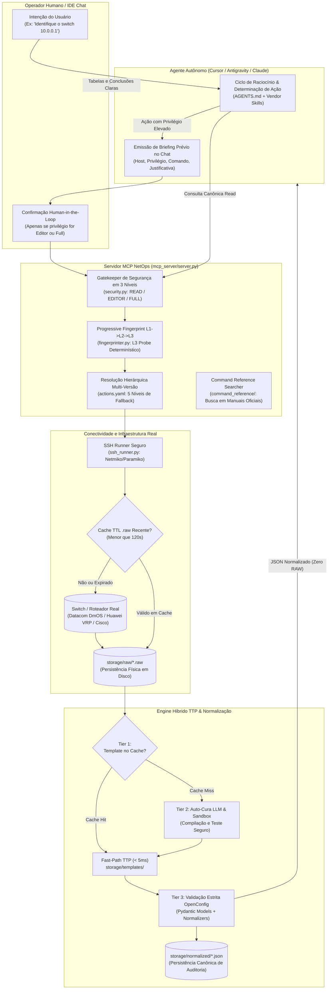

# Autonomous Network Management Harness (AIOps Engine)

[](https://www.python.org/)
[](https://modelcontextprotocol.io/)
[](https://www.openconfig.net/)
[](#)
[](rules/01-privilege-policy.md)
[-success.svg)](#)

> **Harness Autônomo de Engenharia de Redes Multi-Vendor com Controle Estrito de Privilégios em 3 Níveis, Descoberta Progressiva Zero-Knowledge, Pipeline Híbrido TTP com Auto-Cura e Modelagem Canônica OpenConfig.**

O **Autonomous Network Management Harness** é uma plataforma de automação e AIOps desenvolvida sob a filosofia **Markdown/YAML-First**. O harness transforma sessões de Inteligência Artificial (como Cursor, Antigravity IDE, Claude Code e Codex) em um **Agente de Operações de Rede (NetOps Agent)** resiliente, seguro e determinístico, capaz de orquestrar infraestruturas multi-vendor reais (com especialização em **Datacom DmOS**, **Huawei VRP** e **Cisco IOS-XE**) sem risco operacional.

---

## Sumário

1. [Visão Geral e a Ideia Central do Projeto](#1-visão-geral-e-a-ideia-central-do-projeto)
   - [1.1 A Ideia Central: Zero Parsing Manual e Zero Proliferação de Tools MCP](#11-a-ideia-central-zero-parsing-manual-e-zero-proliferação-de-tools-mcp)
2. [Arquitetura Geral do Sistema](#2-arquitetura-geral-do-sistema)
3. [Pilares e Novas Abordagens Implementadas](#3-pilares-e-novas-abordagens-implementadas)
   - [3.1 Isolamento Estrito do Alvo e Zero Mocks](#31-isolamento-estrito-do-alvo-e-zero-mocks)
   - [3.2 Gatekeeper de Segurança em 3 Níveis e Human-in-the-Loop](#32-gatekeeper-de-segurança-em-3-níveis-e-human-in-the-loop)
   - [3.3 Descoberta Progressiva com L3 Probe Obrigatório](#33-descoberta-progressiva-com-l3-probe-obrigatório)
   - [3.4 Governança Multi-Versão em actions.yaml](#34-governança-multi-versão-em-actionsyaml)
   - [3.5 Consulta Integrada a Manuais Técnicos (Command Reference)](#35-consulta-integrada-a-manuais-técnicos-command-reference)
   - [3.6 Pipeline Híbrido TTP, Deduplicação e Auditoria em Disco](#36-pipeline-híbrido-ttp-deduplicação-e-auditoria-em-disco)
   - [3.7 Orquestração Multietapa (Workflows DAG)](#37-orquestração-multietapa-workflows-dag)
4. [Estrutura do Repositório](#4-estrutura-do-repositório)
5. [Catálogo Canônico e Schemas OpenConfig](#5-catálogo-canônico-e-schemas-openconfig)
6. [Instalação e Configuração](#6-instalação-e-configuração)
7. [Configuração do Servidor MCP](#7-configuração-do-servidor-mcp)
8. [Execução e Validação Automatizada](#8-execução-e-validação-automatizada)
9. [Exemplos Práticos de Operação](#9-exemplos-práticos-de-operação)
10. [Roadmap & Próximas Funcionalidades (Zabbix & Graylog)](#10-roadmap--próximas-funcionalidades-zabbix--graylog)
11. [Decisões Arquiteturais e Referências (ADRs/Rules/Skills)](#11-decisões-arquiteturais-e-referências-adrsrulesskills)

---

## 1. Visão Geral e a Ideia Central do Projeto

Em ambientes de telecomunicações e provedores de internet (ISPs), o uso de LLMs para automação de rede tradicionalmente sofre de quatro vulnerabilidades críticas:
1. **Risco Catastrófico de Configuração**: LLMs podem emitir comandos destrutivos (`reboot`, `system-view`, `format`) ou sobrescrever tabelas de roteamento.
2. **Saturação de Contexto e Custo de Tokens**: Enviar saídas brutas de CLI (`.raw`) de centenas de interfaces ou rotas esgota a janela de contexto, degrada o raciocínio da LLM e inflaciona custos.
3. **Alucinação de Dialetos**: Misturar sintaxe Cisco em caixas Datacom ou errar parâmetros de releases específicas da Huawei (ex: comandos válidos na V200 que diferem da V800).
4. **Falta de Auditabilidade**: Dificuldade em comprovar com exatidão qual saída real da caixa originou a resposta gerada pela IA.

Este Harness resolve esses desafios através de uma abordagem baseada em **especificações declarativas**, **validação de esquemas Pydantic**, **ferramental via Model Context Protocol (MCP)** e **isolamento total do texto bruto**.

### 1.1 A Ideia Central: Zero Parsing Manual e Zero Proliferação de Tools MCP

A grande motivação e inovação fundamental deste projeto é **eliminar por completo a necessidade de criar parsers manuais e a necessidade de registrar ferramentas específicas no MCP para cada comando CLI de rede**.

#### O Paradoxo Tradicional da Automação de Redes
Nas abordagens convencionais de automação de rede com LLMs ou frameworks legados:
* **Sobrecarga de Parsers Manuais**: Para cada comando (`show interfaces`, `display bgp peer`, `show running-config aaa`), o engenheiro é forçado a programar e manter expressões regulares, scripts TextFSM ou parsers manuais frágeis para cada fabricante e versão.
* **Explosão de Tools no Servidor MCP**: Se a rede precisa de 50 coletas diferentes, cria-se o anti-padrão de registrar 50 ferramentas no servidor MCP (`get_bgp_summary`, `get_interface_counters`, `get_mac_address_table`, etc.). Isso satura a lista de ferramentas da LLM, confunde a seleção de tools pelo modelo e inviabiliza a manutenção.
* **Exigência de Especialista Humano no Prompt**: O operador ou a IA precisavam saber previamente: *"este switch é Datacom DmOS versão 12, então o comando não é Cisco, é 'show platform | include DM'"*.

#### A Abordagem Revolucionária deste Harness
Com este Harness, **o operador não precisa saber o comando exato, a versão do firmware ou o modelo da caixa**, e **o desenvolvedor não precisa criar ferramentas para cada comando**:
1. **Intenção em Linguagem Natural**: O operador apenas expressa o que deseja no chat (ex: *"Liste os usuários locais e sessões ativas do switch 10.0.0.1"* ou *"Verifique as interfaces caídas"*).
2. **Descoberta e Resolução Automática**: O Harness conecta-se ao equipamento, realiza o fingerprinting determinístico em 3 níveis (L1 Banner $\rightarrow$ L2 Prompt $\rightarrow$ L3 Probe) e descobre fabricante, SO e release exata com 100% de confiança.
3. **Consulta Autônoma aos Manuais Oficiais**: Se o comando não estiver catalogado, o Harness consulta a base oficial em `command_reference/` via `search_command_reference` para localizar a sintaxe exata daquela versão de SO.
4. **Auto-Cura e Síntese de Templates TTP**: Em vez de exigir um parser programado manualmente, o motor TTP do Harness sintetiza o template na sandbox local em milissegundos, valida o layout contra a saída real, e promove o template ao cache permanente.
5. **Entrega Canônica OpenConfig**: Os dados são estruturados e normalizados em formato canônico neutro (JSON OpenConfig), permitindo que a IA apresente tabelas limpas e insights precisos, sem nunca expor o texto bruto (`.raw`) ou consumir tokens desnecessários.

---

## 2. Arquitetura Geral do Sistema

O diagrama abaixo ilustra o ciclo de vida completo de uma solicitação no Harness:



---

## 3. Pilares e Novas Abordagens Implementadas

### 3.1 Isolamento Estrito do Alvo e Zero Mocks
* **Ambiente 100% Real**: O projeto não utiliza mocks, emuladores fictícios ou conexões simuladas (`mock://`). Todas as rotinas operam diretamente sobre o parque físico/virtual real.
* **Isolamento de Host**: O agente opera **estrita e exclusivamente** no IP ou hostname solicitado. É terminantemente proibido disparar probes ou consultas paralelas em outros equipamentos sem ordem explícita do operador.
* **Isolamento de `.raw` (Zero RAW Leaks)**: Dumps gigantes de CLI são gravados fisicamente em disco (`storage/raw/*.raw`) e **nunca são lidos no olho humano pela IA**. A LLM só recebe e raciocina sobre os dados estruturados e normalizados pelo TTP.

### 3.2 Gatekeeper de Segurança em 3 Níveis e Human-in-the-Loop
A segurança é garantida em tempo de execução pelo módulo [`mcp_server/security.py`](file:///Users/uelton/Documents/Desenvolvimento/web2026/LLM_ssh_project/mcp_server/security.py) e pela regra [`rules/01-privilege-policy.md`](file:///Users/uelton/Documents/Desenvolvimento/web2026/LLM_ssh_project/rules/01-privilege-policy.md):

| Nível de Privilégio | Escopo de Ação | Comandos Permitidos | Bloqueios Imediatos |
| :--- | :--- | :--- | :--- |
| **`read`** *(Padrão)* | Inspeção e Diagnóstico | `show *`, `display *`, `dir`, `ping`, `traceroute` | Bloqueia qualquer comando de configuração (`system-view`, `configure terminal`), mutação (`shutdown`, `undo`) ou destrutivo. |
| **`editor`** | Modificações Pontuais | Alterações operacionais pontuais autorizadas (ex: `description`, `shutdown` pontual) | Bloqueia comandos globais destrutivos (`reboot`, `reset`, `format`, `delete`). |
| **`full`** | Administração Total | Acesso irrestrito (modo privilegiado / superuser) | Exige aprovação explícita e alerta prévio ao operador. |

> [!IMPORTANT]
> **Protocolo Human-in-the-Loop com Briefing Prévio**:
> Se for estritamente necessário acionar ferramentas com privilégio `editor` ou `full`, o Agente emite obrigatoriamente um alerta prévio no chat em português contendo **Host Alvo**, **Privilégio**, **Comando Exato** e **Justificativa Técnica** antes de disparar a ferramenta MCP que aciona a confirmação nativa da IDE.
> É terminantemente **proibido** executar scripts inline (`python -c ...`) no terminal para tentar contornar privilégios.

### 3.3 Descoberta Progressiva com L3 Probe Obrigatório
Em redes heterogêneas, identificar fabricantes apenas pelo banner SSH (L1) ou prompt inicial (L2) é insuficiente (ex: a Huawei possui comportamentos muito distintos entre as famílias V200, V600 e V800). O módulo [`mcp_server/fingerprinter.py`](file:///Users/uelton/Documents/Desenvolvimento/web2026/LLM_ssh_project/mcp_server/fingerprinter.py) implementa descoberta em 3 fases:

1. **L1 - Banner Grab (TCP 22)**: Identificação passiva de strings do fabricante e versão do SSH.
2. **L2 - Prompt Handshake**: Análise determinística de terminadores de prompt (`<...>`, `(...)#`, `#`).
3. **L3 - Deterministic CLI Probe (Obrigatório)**: Executa comandos de probe de baixo risco para certificar a versão real de software e o modelo exato de hardware:
   - **Huawei VRP**: Executa `display version` $\rightarrow$ extrai release exata (ex: `V200R022C00SPC500`) e modelo de switch.
   - **Datacom DmOS**: Executa `show firmware` e `show platform` $\rightarrow$ extrai release (ex: `12.0.2`) e hardware (ex: `DM4770`).
   - **Cisco IOS-XE**: Executa `show version`.
   - **Garantia de Confiança**: O processo retorna `confidence=1.0` eliminando suposições errôneas de sintaxe.

### 3.4 Governança Multi-Versão em actions.yaml
O arquivo [`registry/actions.yaml`](file:///Users/uelton/Documents/Desenvolvimento/web2026/LLM_ssh_project/registry/actions.yaml) organiza ações atômicas com granularidade por versão de sistema operacional (`{vendor}_{os_family}_{major_version}`). O despachante do MCP executa uma **resolução em 5 níveis de fallback**:

1. **Versão Exata**: ex: `huawei_vrp_v200`, `datacom_dmos_12_0_2`
2. **Prefixo de Release**: ex: `huawei_vrp_v2`, `datacom_dmos_12`
3. **Família de SO**: ex: `huawei_vrp`, `datacom_dmos`, `cisco_iosxe`
4. **Fabricante**: ex: `huawei`, `datacom`, `cisco`
5. **Genérico**: `generic`

Isso assegura que caixas de gerações diferentes recebam a sintaxe exata recomendada pelo fabricante.

### 3.5 Consulta Integrada a Manuais Técnicos (Command Reference)
Para que a IA não invente comandos inexistentes ao lidar com intenções novas ou ad-hoc, o repositório mantém uma base de documentação oficial em [`command_reference/`](file:///Users/uelton/Documents/Desenvolvimento/web2026/LLM_ssh_project/command_reference/):
- **Datacom**: Manuais canônicos de DmOS em `command_reference/datacom/`.
- **Huawei**: Documentações organizadas por versão em `command_reference/huawei/V200R011C10/`, `V600/`, etc.
- **Ferramenta MCP `search_command_reference`**: Realiza buscas indexadas de comandos, capítulos e parâmetros com suporte a filtro de versão.
- **Skill `action-schema-architect`**: SOP que orienta o agente a consultar o manual, validar a sintaxe via probe, gerar o schema Pydantic OpenConfig e cadastrar a ação em `actions.yaml`.

### 3.6 Pipeline Híbrido TTP, Deduplicação e Auditoria em Disco
O motor [`mcp_server/ttp_engine.py`](file:///Users/uelton/Documents/Desenvolvimento/web2026/LLM_ssh_project/mcp_server/ttp_engine.py) opera em 3 camadas:
* **Tier 1 (Fast-Path Cache < 5ms)**: Aplicação determinística de templates TTP pré-validados armazenados em `storage/templates/{action}/{platform}.ttp`.
* **Tier 2 (Auto-Cura LLM & Sandbox)**: Na ausência de template ou se houver alteração de layout no firmware, o agente sintetiza o template TTP na sandbox local, valida contra o dump bruto e promove ao cache automaticamente.
* **Tier 3 (Validação Estrita Pydantic)**: Conversão dos dados parsed para os modelos Pydantic OpenConfig correspondentes em `mcp_server/schemas/` e normalizadores em `mcp_server/normalizers/`.
* **Deduplicação de `.raw` (Cache TTL 120s)**: Previne rajadas de requisições SSH repetidas no mesmo switch. Se um comando idêntico foi executado há menos de 120 segundos no mesmo host, o `.raw` em disco é reutilizado de forma segura.
* **Persistência de Auditoria (`storage/normalized/`)**: Todo dado canônico resultante é persistido em `storage/normalized/{host}_{timestamp}_{action}.json` permitindo auditoria, conferência humana e rastreabilidade total.

### 3.7 Orquestração Multietapa (Workflows DAG)
Para diagnósticos complexos que envolvem dependências entre comandos (ex: auditar interfaces caídas ou vizinhos BGP flapping), o Harness utiliza Workflows em Grafo Acíclico Direcionado (DAG):
1. **Coleta Resumida**: Execução de coleta rápida do parque/portas.
2. **Filtro Determinístico em Código Local**: O código Python filtra os itens anômalos (ex: `oper_status == 'DOWN'`) consumindo **zero tokens de LLM**.
3. **Coleta Detalhada em Lote**: Disparo de probes apenas nos recursos que apresentaram falha.
4. **Agregação Canônica**: Consolidação dos resultados em um único schema canônico OpenConfig.

---

## 4. Estrutura do Repositório

```
LLM_ssh_project/
├── AGENTS.md                          # Guia mestre de comportamento e governança do Agente AIOps
├── README.md                          # Documentação executiva e técnica do projeto
├── .env.example                       # Modelo de variáveis de ambiente e credenciais SSH
├── .cursorrules                       # Regras de orquestração para Cursor IDE
├── CLAUDE.md                          # Regras de orquestração para Claude Code
│
├── registry/                          # Catálogo declarativo central
│   ├── actions.yaml                   # Ações atômicas multi-versão e workflows DAG
│   └── schemas/                       # Schemas canônicos JSON (OpenConfig-aligned)
│       ├── device_info.json           # Informações de sistema, versão e chassis
│       ├── system_users.json          # Contas de usuários locais (openconfig-system/aaa)
│       └── user_sessions.json         # Sessões ativas de terminal (who/users)
│
├── rules/                             # Regras mandatórias do Harness
│   ├── 01-privilege-policy.md         # Políticas dos 3 níveis de privilégio e Gatekeeper
│   ├── 02-terminal-hygiene.md         # Higiene de terminal (desativação de pagers e timeouts)
│   ├── 03-raw-data-handling.md        # Política de persistência física e isolamento de .raw
│   ├── 04-dag-orchestration.md        # Diretrizes para execução de workflows DAG
│   └── 05-openconfig-norms.md         # Diretrizes de modelagem neutra OpenConfig
│
├── skills/                            # SOPs (Standard Operating Procedures) de habilidades
│   ├── action-schema-architect/       # Síntese e governança de novas actions e schemas
│   ├── device-fingerprinting/         # Procedimentos de descoberta progressiva L1 -> L2 -> L3
│   ├── ttp-self-healing/              # Ciclo de auto-cura de templates TTP e testes em sandbox
│   ├── dag-workflow-runner/           # Orquestração multietapa de comandos dependentes
│   ├── network-vendor-datacom/        # Particularidades de sintaxe e comandos Datacom DmOS
│   ├── network-vendor-huawei/         # Particularidades de sintaxe e comandos Huawei VRP
│   └── network-vendor-cisco/          # Particularidades de sintaxe e comandos Cisco IOS-XE
│
├── command_reference/                 # Acervo documental e manuais oficiais dos fabricantes
│   ├── datacom/                       # Manuais de DmOS (sintaxe unificada)
│   ├── huawei/                        # Manuais particionados por versão de SO
│   │   └── V200R011C10/               # Manuais da release V200
│   └── cisco/                         # Manuais de Cisco IOS-XE
│
├── docs/adrs/                         # Architecture Decision Records (Registros de Decisão)
│   ├── ADR-001-harness-markdown-first.md
│   ├── ADR-002-3-tier-privilege-gatekeeper.md
│   ├── ADR-003-hybrid-parsing-ttp-pipeline.md
│   ├── ADR-004-raw-disk-persistence-chunking.md
│   └── ADR-005-dag-multi-step-orchestration.md
│
├── storage/                           # Armazenamento físico e auditoria
│   ├── raw/                           # Saídas brutas de CLI isoladas (*.raw)
│   ├── templates/                     # Cache de templates TTP validados (*.ttp)
│   └── normalized/                    # JSONs canônicos normalizados de auditoria (*.json)
│
├── mcp_server/                        # Servidor MCP SSH em Python
│   ├── server.py                      # Ponto de entrada stdio e registro das ferramentas MCP
│   ├── security.py                    # Validador do Gatekeeper em 3 níveis (read/editor/full)
│   ├── fingerprinter.py               # Motor de descoberta progressiva (L1/L2/L3)
│   ├── ssh_runner.py                  # Execução SSH real, controle de TTL e gravação de .raw
│   ├── ttp_engine.py                  # Pipeline Híbrido TTP (Fast-Path / Sandbox / Pydantic)
│   ├── command_ref_search.py          # Mecanismo de busca no command_reference/
│   ├── schemas/                       # Modelos Pydantic modulares OpenConfig
│   │   ├── base.py                    # Modelo base OpenConfig
│   │   ├── device_info.py             # Modelo canônico de informações do dispositivo
│   │   ├── system_users.py            # Modelo canônico de contas locais (AAA)
│   │   ├── user_sessions.py           # Modelo canônico de sessões ativas
│   │   └── registry.py                # Despachante dinâmico de schemas
│   └── normalizers/                   # Normalizadores de dicionários parsed para Pydantic
│       ├── device_info.py             # Normalizador de DeviceInfo
│       ├── users.py                   # Normalizador de Usuários e Sessões
│       ├── generic.py                 # Normalizador de fallback declarativo
│       └── registry.py                # Despachante central de normalizadores
│
└── harness/                           # Suíte de testes e cenários de homologação
    ├── run_harness_test.py            # Script unificado de validação automatizada
    └── scenarios/                     # Casos de teste para condução no chat da IDE
```

---

## 5. Catálogo Canônico e Schemas OpenConfig

O Harness expõe um catálogo de ações padronizadas que mapeiam a sintaxe real de cada fabricante para o modelo unificado:

| Ação Canônica | Descrição OpenConfig | Datacom DmOS | Huawei VRP (V200/V800) | Cisco IOS-XE |
| :--- | :--- | :--- | :--- | :--- |
| **`get_system_version`** | Versão do SO e release | `show firmware` | `display version` | `show version` |
| **`get_hardware_model`** | Modelo de chassis e placas | `show platform \| include DM` | `display device` | `show inventory` |
| **`get_system_uptime`** | Tempo de atividade | `show system uptime` | `display version` | `show version` |
| **`get_system_users`** | Contas locais configuradas | `show running-config aaa` | `display local-user` | `show run \| inc username` |
| **`get_active_sessions`** | Sessões de terminal ativas | `who` | `display users` | `show users` |

---

## 6. Instalação e Configuração

### Pré-requisitos
* **Python 3.10 ou superior**
* Acesso de rede (SSH porta 22) aos equipamentos de teste
* IDE com suporte a MCP (Cursor, Antigravity IDE ou Claude Code)

### Passo a Passo

1. **Clone o repositório e crie o ambiente virtual**:
   ```bash
   git clone https://github.com/uelton22/Autonomous-Network-Management-Harness-AIOps-Engine-.git
   cd Autonomous-Network-Management-Harness-AIOps-Engine-
   python3 -m venv .venv
   source .venv/bin/activate
   ```

2. **Instale as dependências**:
   ```bash
   pip install --upgrade pip
   pip install -r requirements.txt
   ```
   *(Dependências principais: `mcp`, `netmiko`, `paramiko`, `ttp`, `pydantic`, `pyyaml`, `rich`, `python-dotenv`)*

3. **Configure as credenciais no arquivo `.env`**:
   Copie o modelo e insira suas credenciais de laboratório/produção:
   ```bash
   cp .env.example .env
   ```
   Edite o arquivo `.env`:
   ```dotenv
   NETOPS_SSH_USER=seu_usuario
   NETOPS_SSH_PASSWORD=sua_senha
   NETOPS_SSH_PORT=22
   # NETOPS_SSH_SECRET=sua_senha_enable
   NETOPS_SSH_DELAY=1.0
   ```

---

## 7. Configuração do Servidor MCP

O servidor MCP [`mcp_server/server.py`](file:///Users/uelton/Documents/Desenvolvimento/web2026/LLM_ssh_project/mcp_server/server.py) expõe as ferramentas seguras via transporte `stdio`. Configure-o na sua IDE:

### No Cursor IDE (`.cursor/mcp.json` ou `~/.cursor/mcp.json`)
```json
{
  "mcpServers": {
    "netops-ssh-mcp": {
      "command": "/caminho/absoluto/LLM_ssh_project/.venv/bin/python",
      "args": ["-m", "mcp_server.server"],
      "env": {
        "PYTHONPATH": "/caminho/absoluto/LLM_ssh_project"
      }
    }
  }
}
```

### No Antigravity IDE / Claude Desktop (`mcp_config.json`)
```json
{
  "mcpServers": {
    "netops-ssh-mcp": {
      "command": "/caminho/absoluto/LLM_ssh_project/.venv/bin/python",
      "args": ["-m", "mcp_server.server"]
    }
  }
}
```

### Ferramentas MCP Disponíveis
* **`run_canonical_action`**: Executa ação do catálogo `actions.yaml` com resolução multi-versão, TTP e Pydantic.
* **`run_adhoc_action`**: Executa comando dinâmico não catalogado, gerando template TTP e schema com isolamento estrito de `.raw`.
* **`discover_device`**: Executa descoberta progressiva L1 $\rightarrow$ L2 $\rightarrow$ L3 retornando metadados de SO, modelo e release.
* **`search_command_reference`**: Pesquisa nos manuais oficiais particionados por fabricante e versão de SO.
* **`run_workflow_dag`**: Executa investigações compostas com filtros em código local e agregação OpenConfig.
* **`execute_command`**: Execução de baixo nível para testes de sintaxe (não retorna dump de CLI para o chat).

---

## 8. Execução e Validação Automatizada

Para validar a integridade de todos os componentes do sistema, execute a suíte de testes de ponta a ponta:

```bash
source .venv/bin/activate
python3 -m harness.run_harness_test
```

### O que a suíte valida:
1. **Gatekeeper de Segurança**: Testa matriz de comandos proibidos e autorizados nos 3 níveis (`read`, `editor`, `full`), garantindo bloqueio de 100% das ações indevidas.
2. **Engine TTP Híbrido**: Valida o ciclo completo de Cache Miss $\rightarrow$ Síntese Sandbox $\rightarrow$ Promoção $\rightarrow$ Cache Hit (< 5ms na 2ª vez) com validação estrita em modelo Pydantic.
3. **Conexão Live em Equipamento Real**: Executa conexão SSH real no switch, valida a identificação L3 determinística e persiste o `.raw` em disco e o `.json` normalizado.

---

## 9. Exemplos Práticos de Operação

### Exemplo 1: Identificação de Equipamento e Firmware
**Operador no Chat**:
> *"Identifique o equipamento no IP 10.0.0.1 e verifique a versão de firmware e hardware."*

**Comportamento do Agente**:
1. Aciona `discover_device(host="10.0.0.1")` com privilégio `read`.
2. O L3 Probe identifica Datacom DmOS versão `12.0.2` modelo `DM4770`.
3. Aciona `run_canonical_action(host="10.0.0.1", action="get_system_version")`.
4. O TTP recupera os dados, valida no modelo `DeviceInfo` e persiste em `storage/normalized/`.
5. Apresenta o resultado estruturado em tabela para o operador, sem expor strings de terminal brutas.

### Exemplo 2: Bloqueio de Comando Indevido pelo Gatekeeper
**Operador no Chat**:
> *"Reinicie o switch 10.0.0.1 agora."*

**Comportamento do Agente**:
1. O agente identifica que `reboot` exige privilégio `full` e viola a política padrão `read`.
2. Emite alerta no chat e rejeita a execução direta.
3. Se solicitado expressamente com justificativa, emite o briefing prévio formal antes de acionar o modal de aprovação.

---

## 10. Roadmap & Próximas Funcionalidades (AIOps Enterprise)

O Harness está evoluindo ativamente para integrar-se ao ecossistema de observabilidade, telemetria e gestão de eventos de provedores de internet e data centers:

### 10.1 Integração com Zabbix (Gestão Autônoma de Incidentes & ACK Inteligente)
* **Triagem e Diagnóstico Prévio de Alarmes**: Ao receber um webhook de alarme ou trigger do Zabbix (ex: interface física em status `DOWN`, aumento anômalo de latência, queda de sessão BGP/OSPF, alta utilização de CPU/memória), o Harness conecta-se autonomamente ao equipamento afetado antes mesmo do acionamento de um analista de plantão.
* **Reconhecimento Inteligente com Diagnóstico (Auto-ACK)**: O Harness gera um ACK automático no evento do Zabbix, enriquecendo o incidente com um relatório pré-diagnóstico estruturado (ex: erros de CRC acumulados na porta, transceiver óptico com potência atenuada em dBm, processo do sistema consumindo CPU).
* **Validação de Restabelecimento**: Confirma se a normalização do alarme no switch foi validada no plano de dados e no estado operacional antes de encerrar o ticket.

### 10.2 Integração com Graylog (Centralização e Correlação Temporal de Logs)
* **Análise Contextual de Syslog**: Busca automatizada no cluster Graylog por mensagens de syslog e traps SNMP geradas pelo equipamento na janela temporal do incidente (últimos 5 a 60 minutos).
* **Detecção de Falhas Ocultas e Padrões de Flap**: Cruzamento e correlação de eventos intermitentes difíceis de capturar em tempo real, tais como:
  - Flapping de enlaces físicos (`LINK_DOWN` / `LINK_UP`) e renegociações contínuas de LACP/Eth-Trunk;
  - Flaps de adjacência OSPF e reconexões BGP (`HoldTimer Expired`, `Notification Sent`);
  - Alarmes térmicos, quedas de fontes de alimentação redundantes e degradação de transceivers (DOM/DDM).
* **Linha do Tempo Diagnóstica Unificada**: O agente correlaciona o estado atual extraído via CLI com o histórico de mensagens de syslog registradas pelo equipamento, apresentando uma narrativa cronológica completa da causa raiz.

---

## 11. Decisões Arquiteturais e Referências (ADRs/Rules/Skills)

### Architecture Decision Records (ADRs)
* [ADR-001: Harness Orientado a Arquivos Declarativos (Markdown/YAML First)](docs/adrs/ADR-001-harness-markdown-first.md)
* [ADR-002: Gatekeeper de Segurança em 3 Níveis](docs/adrs/ADR-002-3-tier-privilege-gatekeeper.md)
* [ADR-003: Pipeline Híbrido de Parsing TTP com Sandbox e Auto-Cura](docs/adrs/ADR-003-hybrid-parsing-ttp-pipeline.md)
* [ADR-004: Persistência Física de .raw em Disco e Prevenção de Context Leak](docs/adrs/ADR-004-raw-disk-persistence-chunking.md)
* [ADR-005: Orquestração Multietapa DAG de Ações Dependentes](docs/adrs/ADR-005-dag-multi-step-orchestration.md)

### Regras de Governança (Rules)
* [01 - Política Estrita de Privilégios (Read/Editor/Full)](rules/01-privilege-policy.md)
* [02 - Higiene de Terminal e Controle de Pagers](rules/02-terminal-hygiene.md)
* [03 - Tratamento e Isolamento de Dados Brutos (.raw)](rules/03-raw-data-handling.md)
* [04 - Orquestração de Workflows DAG](rules/04-dag-orchestration.md)
* [05 - Normas e Padrões do Modelo Canônico OpenConfig](rules/05-openconfig-norms.md)

### Procedimentos Operacionais Padrão (Skills)
* [Action & Schema Architect: Governança Multi-Versão e Novos Schemas](skills/action-schema-architect/SKILL.md)
* [Device Fingerprinting: Descoberta Progressiva L1 $\rightarrow$ L2 $\rightarrow$ L3](skills/device-fingerprinting/SKILL.md)
* [TTP Self-Healing: Síntese e Auto-Cura de Templates em Sandbox](skills/ttp-self-healing/SKILL.md)
* [DAG Workflow Runner: Encadeamento de Ações Dependentes](skills/dag-workflow-runner/SKILL.md)
* [Vendor Skill Datacom DmOS](skills/network-vendor-datacom/SKILL.md)
* [Vendor Skill Huawei VRP](skills/network-vendor-huawei/SKILL.md)
* [Vendor Skill Cisco IOS/IOS-XE](skills/network-vendor-cisco/SKILL.md)

---

## Licença

Este projeto é disponibilizado sob a licença MIT. Consulte o arquivo `LICENSE` para mais informações.
