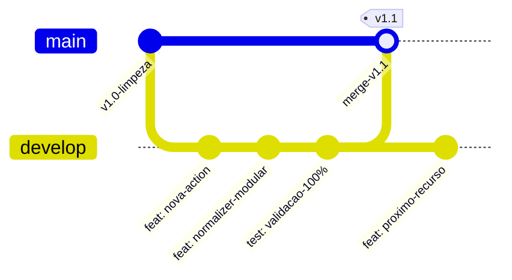

# Guia de Fluxo de Branches e Versionamento Git (Git Workflow)

Este documento define a rotina operacional de ramificação, desenvolvimento e junção de código adotada no projeto **Autonomous Network Management Harness (AIOps Engine)**.

---

## 1. Estrutura e Papéis das Branches

O projeto adota o padrão de ramificação baseado em `main` (estável/produção) e `develop` (desenvolvimento contínuo):



### 1.1 `main` (Branch Principal / Produção)
* **Status**: Estável, limpa e validada.
* **Política de Proteção**: **Nenhum desenvolvimento direto deve ocorrer nesta branch**. Ela reflete o estado zero ou as versões de produção do Harness com testes 100% aprovados.
* **Atualização**: Recebe código exclusivamente através de `merge` vindo da branch `develop`.

### 1.2 `develop` (Branch de Trabalho e Funcionalidades)
* **Status**: Ativa.
* **Uso**: Onde todas as implementações cotidianas são realizadas (novas ações atômicas, schemas declarativos JSON, modelos Pydantic, normalizadores especialistas, templates TTP e integrações com o MCP).
* **Rastreamento**: Aponta diretamente para `origin/develop` no GitHub.

---

## 2. Rotina Diária de Desenvolvimento

Ao iniciar e trabalhar em novas funcionalidades, execute os passos abaixo diretamente na branch `develop`:

### Passo 1: Confirmar a branch ativa
Certifique-se de que está operando na branch `develop`:
```bash
git branch
# Deve exibir * develop
```
Se estiver em outra branch, alterne com:
```bash
git checkout develop
```

### Passo 2: Desenvolver e Testar Localmente
Implemente os schemas, normalizadores ou templates necessários. Antes de registrar qualquer commit, garanta que a suíte de testes unitários passe com 100% de sucesso:
```bash
PYTHONPATH=. .venv/bin/pytest tests/
```

### Passo 3: Registrar e Publicar Alterações
Com os testes aprovados, realize o commit das mudanças e envie para o GitHub:
```bash
git add .
git commit -m "feat(actions): adiciona suporte a nova funcionalidade"
git push
```
*(O comando `git push` atualizará automaticamente a branch `develop` no repositório remoto).*

---

## 3. Rotina de Junção com a Branch Principal (`main`)

Quando um conjunto de funcionalidades ou módulo estiver concluído, testado e validado em campo (ex: testes reais via MCP), realize a junção com a `main`.

### Opção A: Junção Direta via Terminal (CLI)

1. **Garantir que a branch `develop` está salva e limpa:**
   ```bash
   git status
   # Deve exibir: "nothing to commit, working tree clean"
   ```

2. **Alternar para a branch `main` e atualizá-la:**
   ```bash
   git checkout main
   git pull origin main
   ```

3. **Mesclar as alterações da `develop` para a `main`:**
   ```bash
   git merge develop
   ```

4. **Executar a suíte de testes na `main` para validação final:**
   ```bash
   PYTHONPATH=. .venv/bin/pytest tests/
   ```

5. **Enviar a `main` atualizada para o GitHub:**
   ```bash
   git push origin main
   ```

6. **Retornar para a `develop` para continuar o trabalho:**
   ```bash
   git checkout develop
   ```

---

### Opção B: Junção via Pull Request no GitHub (Recomendado para Revisão)

1. Após enviar os commits para a branch `develop` (`git push origin develop`):
2. Acesse a interface do GitHub do repositório:
   [Criar Pull Request no GitHub](https://github.com/uelton22/Autonomous-Network-Management-Harness-AIOps-Engine-/pull/new/develop)
3. Defina a base como `base: main` e o comparativo como `compare: develop`.
4. Revise o resumo de arquivos alterados e clique em **Create Pull Request**.
5. Clique em **Merge pull request** e confirme.
6. Localmente em sua máquina, atualize sua cópia da `main`:
   ```bash
   git checkout main
   git pull origin main
   git checkout develop
   ```

---

## 4. Tabela Rápida de Comandos (Cheat Sheet)

| Operação | Comando | Descrição |
| :--- | :--- | :--- |
| **Ver branch atual** | `git status` ou `git branch` | Exibe em qual branch você está trabalhando |
| **Trocar para develop** | `git checkout develop` | Retorna para a branch de desenvolvimento |
| **Salvar progresso** | `git add . && git commit -m "msg"` | Cria um ponto de restauração local |
| **Enviar para GitHub** | `git push` | Sincroniza a branch atual com o repositório remoto |
| **Puxar atualizações** | `git pull` | Baixa novidades do GitHub para a máquina local |
| **Validar testes** | `PYTHONPATH=. .venv/bin/pytest tests/` | Roda os testes unitários obrigatórios |
| **Trocar para main** | `git checkout main` | Move para a branch de produção |
| **Fundir develop na main** | `git merge develop` | Mescla o trabalho finalizado na branch principal |
